### Notes Sharing App

# Stack: Go (Fiber, GORM, JWT) + PostgreSQL + Next.js

# 1 Environment variables

    DB_HOST=postgres
    DB_USER=postgres
    DB_PASSWORD=279111
    DB_NAME=notesdb
    DB_PORT=5432
    JWT_SECRET=11092708

---

# 2 How to run database (PostgreSQL)

    Start all services in detached mode:
        docker-compose up -d

    Stop all services:
        docker-compose down

    Rebuild & refresh containers (useful after changes):
        docker-compose down
        docker-compose up --build

    Access PostgreSQL inside container:
        docker exec -it notesdb psql -U postgres -d notesdb

    List databases:
        \l

    Connect to a specific database:
        \c notesdb

    List tables:
        \dt

    View table content:
        SELECT * FROM <table_name>;

    Exit psql:
        \q

---

# 3 How to run backend

    Run backend:
        cd backend
        go run main.go

    Stop backend: press Ctrl + C

---

⚠️ Note: Running go run main.go outside Docker will result in an error because the postgres hostname is not recognized. Use Docker Compose to run the backend and database.

---

# 4 How to run frontend

    run frontend:
        cd frontend
        npm install
        npm run dev

    Stop frontend: press Ctrl + C

    Build & run for production:
        npm run build
        npm run start

---

 ⚠️ Note: The frontend is also connected to the backend via the Docker network.

# 5 Viewing logs (live)

    Backend logs:
        docker-compose logs -f backend

    Frontend logs:
        docker-compose logs -f frontend

    Database logs:
        docker-compose logs -f postgres

---

💡 Tip: Add --tail 100 to see 100 on behind.

---

# 6 API Endpoints

    POST /api/register      → Register new user
    POST /api/login         → Login user
    GET /api/notes          → Get all notes
    POST /api/notes         → Create note
    PUT /api/notes/:id      → Update note
    DELETE /api/notes/:id   → Delete note

---

# 7 Additional tips

    Check ports in use:
        netstat -ano | findstr :<port_number>

    Kill a process by PID (Windows):
        taskkill /PID <PID> /F

    List Docker containers:
        docker ps -a

    Remove unused Docker containers/images:
        docker system prune

---

💡 Note: Frontend deployed on Vercel currently points to local backend. Some features like register/login may not work on Vercel deployment. To fully test these features, run backend locally as described above.

---

# 8 Overview image

  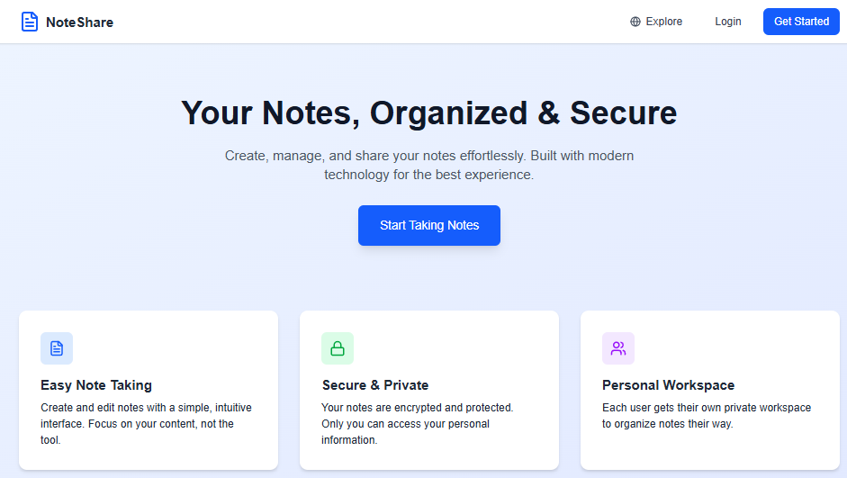
  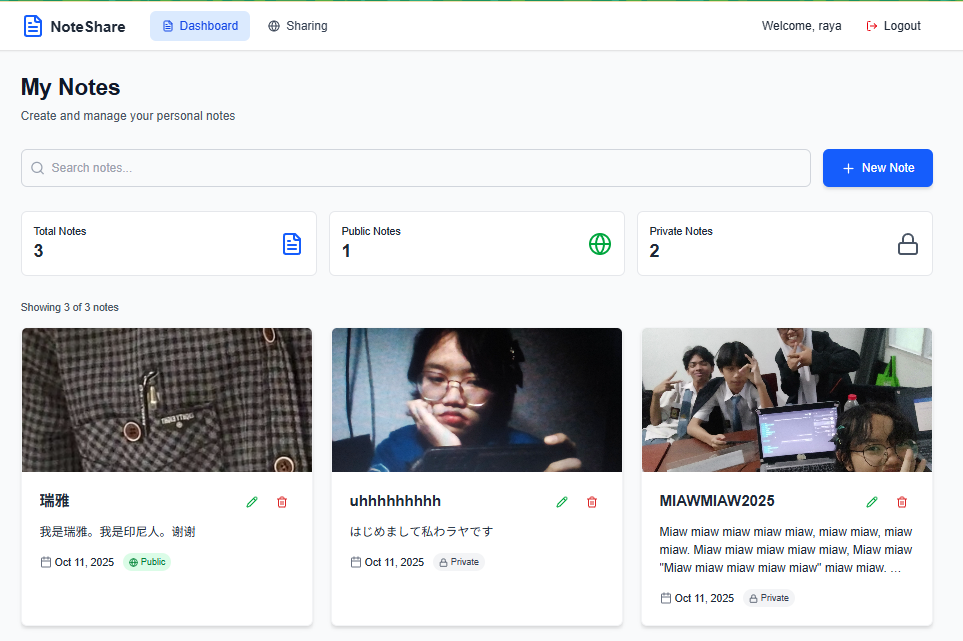
  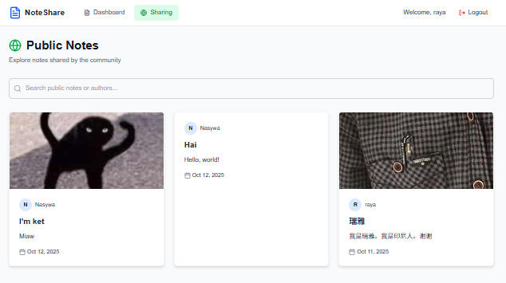
  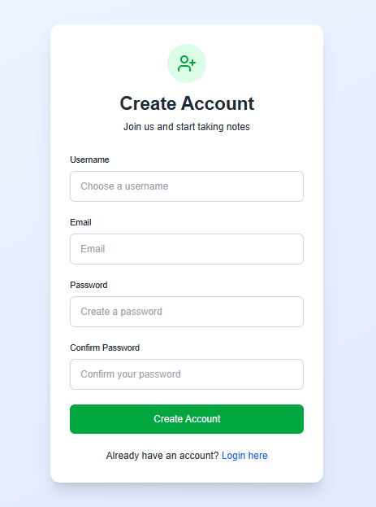
  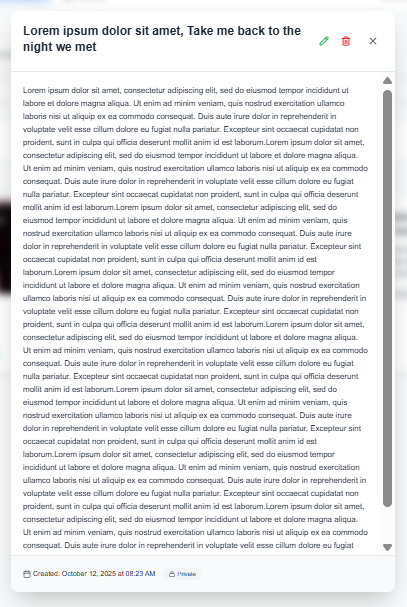
  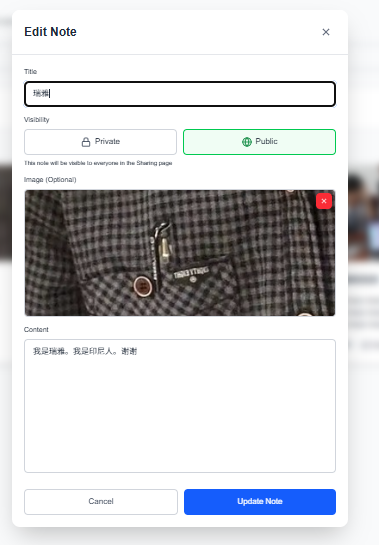
  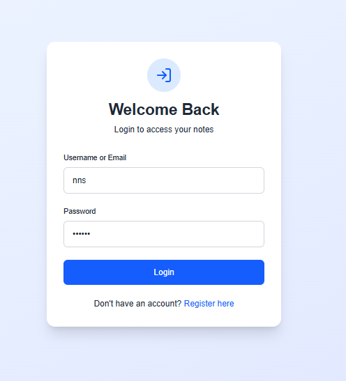
  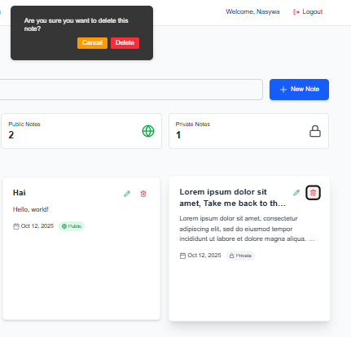
  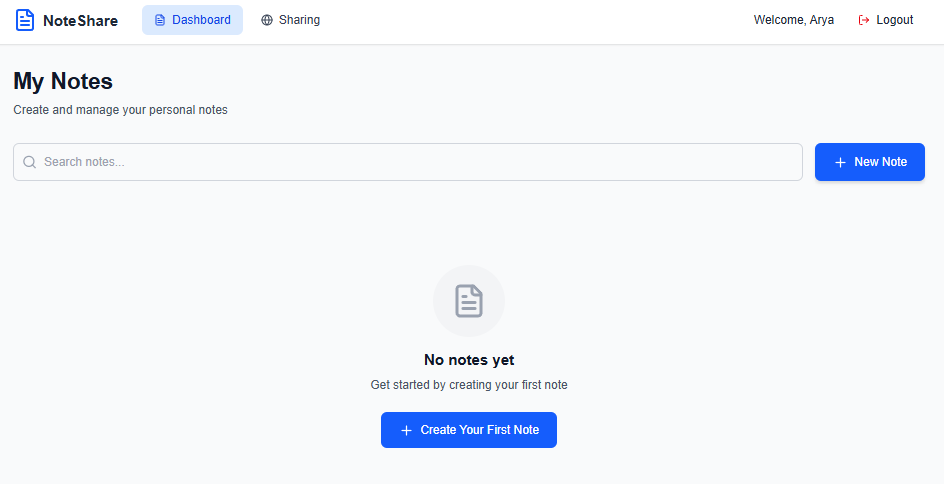
  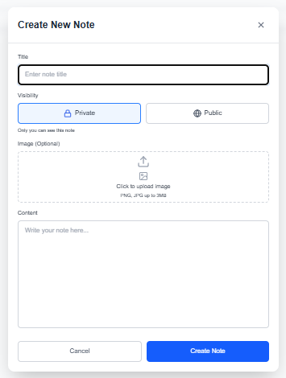
  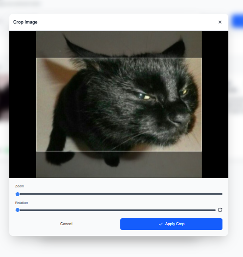
  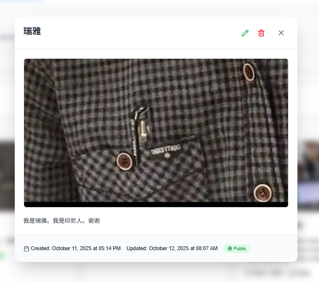
  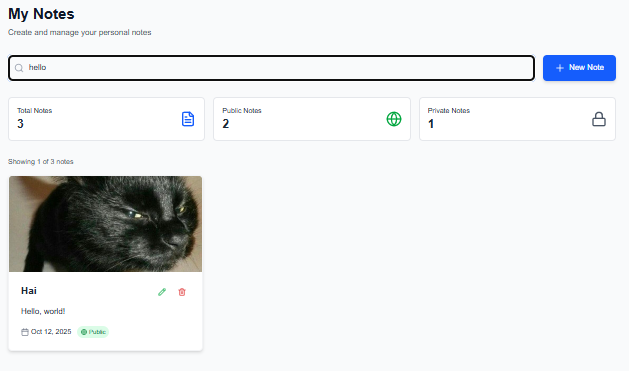
  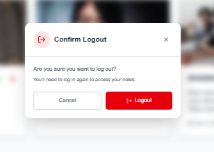

---

File [backend-log.txt](https://github.com/NasywaFA/note-sharing-app/blob/main/backend-log.txt) to see backend logs.
